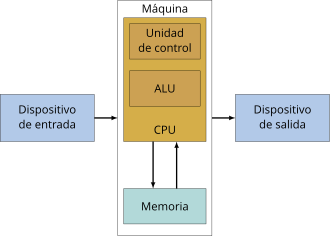
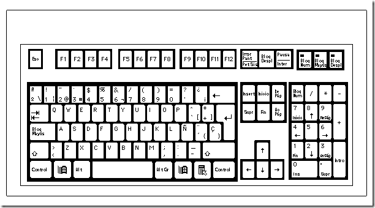
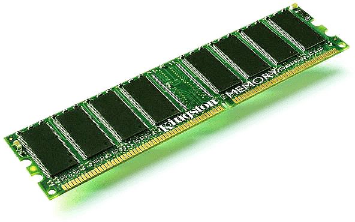
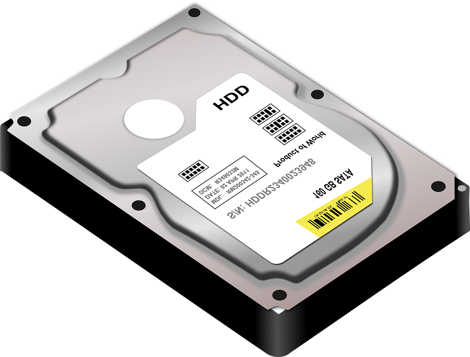
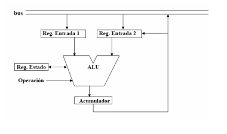

# Tema 1: El funcionamiento del equipo informático.
```
Un equipo informático es un conjunto de software y hardware que se coordinan para el tratamiento automático de la información.
```
Para llevar a cabo el tratamiento de la información, el ordenador consta de elementos físicos denominados *__hardware__*, que son la mayoría electrónicos y trabajan a grandes velocidades con gran presición. Sin embargo, para que esto ocurra, deben existir instrucciones. A estos elementos les denominamos *__software__*.

Entre el hardware y el software se encuentra una aplicación especial que hace de intermediario, denominada *__sistema operativo__*, y en cada ordenador debe existir uno para que sea operativo.

Es entonces, cuando se deduce que la ciencia informática se sustenta en tres bases: el __hardware__, el __software__ y el __elemento humano__.

## Arquitectura de Von Neumann.
```
La arquitectura de un ordenador define su comportamiento funcional.
```

El modelo de arquitectura de los ordenadores actuales se basa en la establecida por el alemán John von Neumann en 1946.



En este tipo de arquitectura vemos partes importantes: 
* El dispositivo de entrada y salida
* La memoria principal.
* La unidad aritmético-lógica (ALU).
* La unidad de control (UC). 

## Componentes importantes de la arquitectura de Von Neumann.

__Dispositivo de entrada y salida__: Es por donde se introducen los datos e instrucciones en el ordenador. En estas unidades se transforman las instrucciones de entrada en señales binarias y permiten mostrar el resultado del tratamiento automático de la información de vuelta al usuario. Un ordenador puede tener varios dispositivos de e/s, como por ejemplo, __teclados__, __monitores__, etc.



__Memoria__: Aquí se almacenan los datos y las instrucciones. Existen dos tipos de memorias que se diferencian principalmente por la velocidad de acceso:

1. __Memoria central__: Actúa con la mayor velocidad y está ligada directamente a las unidades más rápidas del ordenador (UC y ALU). Para que un programa funcione debe estar cargado en la unidad memoria central. La memoria está dividida en posiciones de un determinado número de bits. Para leer o escribir una información es necesario dar dicha posición. Hay dos zonas: La ROM (se puede leer y es permanente) y la RAM (se puede leer y escribir, pero es volátil).



2. __Memoria externa__: Se usan ya que la memoria central no tiene gran capacidad para almacenar información. Se usan discos, discos ópticos, cintas magnéticas, etc. La información guardada permanece indefinidamente hasta que el usuario la borre. 



__Unidad aritmético-lógica (ALU)__: Este componente se encarga de operar de forma aritmética (operaciones matemáticas básicas) y de forma lógica (comparaciones, álgebra booleana).

__Unidad de control (UC)__: Detecta señales de las distintas unidades, indicando su situación. Capta todas las instrucciones de un programa y genera de acuerdo con la instrucción señales de control para todas las unidades, controlando así todas las operaciones que implican la ejecución de la instrucción. Por ejemplo: Si hay que sumar, indica a la ALU que sume los datos y a la memoria que guarde el resultado. 

Otra cosa a tener en cuenta es que cada unidad debe estar sincronizada con las otras. La UC tiene un reloj generador de pulsos que sincroniza todas las operaciones del ordenador.  El periodo de esta señal se denomina __tiempo de ciclo__ y se expresa en nanosegundos. La frecuencia del reloj medida en Megahercios (Mhz) es un parámetro que determina en parte la velocidad del funcionamiento del ordenador. 
```
Una instrucción suele ocupar 1 o varios ciclos de reloj.
```
Otro factor que influye en la velocidad de un computador es el __ancho de banda__, que representa la cantidad de información transferida por segundo entre una unidad y otra. 

El byte es una unidad de información relativamente pequeña para los cálculos que realiza la ALU, por lo que se utiliza una unidad superior que se denomina __palabra__, que está formada por un número entero de bytes (1, 2, 4, 8, 16...) y representa a los datos con los que opera la ALU o a las unidades de información que se transfieren entre la memoria principal y la CPU. La longitud de la palabra coincide con el número de bits que se transfieren entre las unidades del computador central. Suele ser de 32 o 64 bits. 

La __CPU__ (unión entre la UC y la ALU) contiene en su interior elementos para memorizar temporalmente la información correspondiente a una palabra. Estos elementos se denominan registros. Ej.: cuando la ALU va a realizar una suma, los datos con los que va a operar se guardan temporalmente en dos registros y el resultado en un tercero, que suele ser uno de los dos anteriores

En definitva, la potencia de un ordenador está determinada por el __tiempo de ciclo__, el __ancho de banda__ y la __capacidad de memoria__.

## Funcionamiento extendido de los elementos centrales de un ordenador.

__ALU__: Como ya se mencionó, en la unidad aritmético-lógica se hacen operaciones aritméticas y lógicas. Para comunicarse con otras unidades utilizan el __bus de datos__ y para realizar sus operaciones necesitan los siguientes elementos:
1. __Registro de entrada__: Almacena los datos y operandos de las instrucciones antes de que se operen. También se emplea para almacenar temporalmente los resultados intermedios de operaciones.
2. __Registro acumulador__: Almacena los resultados de las operaciones. Está conectada con los registros de entrada para concatenar operaciones. Tiene conexión directa con el bus de datos para el envío de los resultados a la memoria central o a la unidad de control. 
3. __Registro de estado__: Guarda condiciones de la última operación para tener en cuenta en posteriores (errores, etc.).

La ALU tiene una entrada de órdenes por donde se le indica la operación a realizar sobre los registros de entrada.



__UC__: Su función es la de monitorear y controlar el funcionamiento de todo el ordenador, dirigiendo toda la información a las unidades correspondientes en el momento preciso y dando las órdenes necesarias para tratar dichas operaciones. Para realizar su función utiliza los siguientes elementos:

1. __Contador de programa (CP)__: Contiene la dirección de memoria de la siguiente instrucción a ejecutar. Al iniciar la ejecución de un programa toma dirección de su primera instrucción. Incrementará su valor a uno cuando se termine una instrucción salvo cuando ésta sea de salto a otra, en cuyo caso tomará la dirección de la instrucción que se tenga que ejecutar a continuación.
2. __Registro de instrucción (RI)__: Contiene la instrucción en ejecución en ese momento. Lleva el código de operación y en algunos casos los operandos o las direcciones de memoria de los mismos.
3. __Reloj (R)__: Proporciona una sucesión de ciclos a intervalos constantes que marca el ritmo de comienzo de cada instrucción.
4. __Secuenciador__: Genera órdenes elementales (microórdenes) que, sincronizadas por los impulsos del reloj, hacen que se vaya ejecutando poco a poco la instrucción que está cargada en el RI.


__Memoria Central__: Almacena todas las instrucciones que necesita el ordenador. Está constituida por muchas celdas o posiciones de memoria enumeradas de forma consecutiva que son capaces de retener mientras exista alimentación, la información depositada. A esta numeración de celdas se le denomina __dirección de memoria__, y mediante esta dirección se puede acceder de forma directa a cualquier otra. 
La memoria central tiene asociados los siguientes dispositivos:

1. __Registro de dirección de memoria (RDM)__: Antes de la lectura o escritura se coloca en este registro la dirección de la celda que se va a utilizar en la operación, ya sea para grabar en ella o para extraer datos.
2. __Registro de intercambio de memoria (RIM)__: Si es una operación de lectura, este registro contiene el dato de la memoria señalado por el RDM para ser enviado mediante el bus del sistema a la unidad que lo requiere. Si es de escritura, la información procedente de cualquier unidad, es depositada mediante el bus en el RIM para que desde él se transfiera a la posición de memoria indicada por el RDM.
3. __Selector de memoria (SM)__: Es un dispositivo que se activa cada vez que hay una orden de lectura o escritura, conectando la celda de memoria propuesta por el RDM con el RIM, y posibilita la transferencia de datos en un sentido u otro.

En un ordenador normal la memoria principal es la RAM. Cada vez la capacidad de almacenamiento aumenta a medida que pasa el tiempo. Sin embargo, aunque la capacidad real de la memoria es reducida, se ha conseguido que sea mayor de lo esperado gracias a la __memoria virtual__. Esta memoria usa la secundaria para intercambiar la información y expandir la memoria central. DE esta forma se consigue que la información almacenada en la memoria secundaria esté disponible como si estuviera en la central, y así puede procesar peogramas que excedan de la capacidad de la memoria central. 
